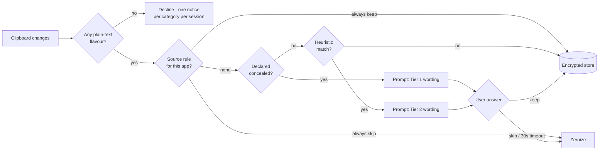

# Spool

A local-only clipboard manager built around **spools** — named, ordered lists of clips that you wind
on by copying and play off one at a time, forwards or backwards, rearranging them by dragging.
Nothing it captures can leave the machine, and that property is enforced by the build, not by good
intentions.

Windows and macOS. Tauri v2 + React. No cloud, no account, no telemetry, no model.

---

## How to work this spec

This is **not** a one-shot specification. It is fourteen milestones, each one a single git push that
leaves a working application behind.

- Implement exactly one milestone per working session. Stop at its end.
- Do not implement a later milestone's features early, even when they look trivial.
- A milestone is done when its acceptance criteria pass and its tests are green — not when the code
  exists.
- Each milestone names its commit message. Use it.
- Work on a branch per milestone and merge via PR, so the §5 network gate actually runs on every
  change. That gate is the product; give it something to check.

If a milestone's acceptance criteria cannot be met as written, stop and say so rather than
substituting a different scope.

---

## 1. Invariants

These hold at every commit. A change that breaks one is wrong even if it passes tests.

1. **No network egress, ever.** The app contains no HTTP client, no socket, no telemetry, no
   updater. Enforced by CI (§5), not by discipline.
2. **Nothing sensitive reaches disk without an explicit yes.** A clip classified sensitive lives in
   memory only until the user decides. Declining zeroizes it.
3. **No privacy guard is a prohibition.** Every sensitivity guard is a prompt or a default. A user
   who wants to store a password can store a password. The capacity floor in §9 is the app's one
   hard gate, and it gates capture only — never access.
4. **Ordering logic is pure.** Spool, cursor, and mode logic has no I/O and is tested without a
   clipboard or a database.
5. **The user's data file survives upgrades.** Schema is versioned with forward migrations, verified
   by upgrading a file written by the previous release.
6. **State is legible.** The active spool, its mode, and the clip that will paste next are always
   visible without opening anything.
7. **Deletion is something the user did.** A clip or a spool goes away because someone chose to
   remove it — never as a side effect of pasting. The single exception is eviction from the capture
   buffer, bounded and stated in §3 Limits.
8. **What is already stored stays reachable.** Capture can be paused, refused, or gated behind a
   choice. Reading, serving, and reordering what is already there never are. No quota takes a user's
   own work away from them.

---

## 2. Vocabulary

| Term | Meaning |
|---|---|
| **Clip** | One captured clipboard item. Text only in v1 — see §4 for what qualifies. |
| **Spool** | A named, ordered list of clips with a mode and a cursor. The app's central object, and its namesake. |
| **Default spool** | The implicit rolling buffer that captures when the user has made none. Mode FIFO. Cannot be deleted; can be cleared. |
| **Saved spool** | A spool the user named and kept, reusable across sessions and never silently trimmed. See §3 Limits. |
| **Starred spool** | A saved spool marked to survive routine clearing. Sorts to the top. See §10. |
| **Cursor** | The clip that the next serve will deliver. Stored as a clip **identity**, not an index. |
| **Serve** | Write the cursor's clip to the system clipboard, then advance the cursor. |
| **Mode** | `fifo` or `lifo`. Sets the direction the cursor travels. |
| **Source rule** | A per-application standing answer to the sensitive-clip prompt. |

**Capitalisation carries meaning here, so it is a rule rather than a habit.** *Spool* is the
application; *a spool* is the object it manages. Never write a sentence where the two could be
swapped — "Spool is full" is about the store, "this spool is full" is about one list of clips. When a
string could read either way, name the thing it is about.

The metaphor is load-bearing rather than decorative: a spool is wound on at one end and played off in
order, in either direction, with a finite capacity. That is the data structure, not a flourish.

---

## 3. FIFO and LIFO, precisely

Given clips captured in order `A, B, C` at positions 0, 1, 2:

| Mode | Serve order | Cursor starts at | Advance | Wraps to |
|---|---|---|---|---|
| `fifo` | A → B → C → A | position 0 (oldest) | +1 | position 0 |
| `lifo` | C → B → A → C | position 2 (newest) | −1 | last position |

**Serving pastes; it does not pop.** No clipboard manager consumes its history on paste, and this one
does not either. Clips remain until the user removes them — a single clip, or a whole spool, by
explicit choice. A spool is a thing you build once and reuse, so using it must not dismantle it.
Settled, not an open question.

**Cursor behavior under every mutation.** This is the part that is easy to get wrong, so it is
specified exhaustively and tested in M2:

| Mutation | Cursor result |
|---|---|
| Capture, `fifo` | Clip appended at end. Cursor does not move. |
| Capture, `lifo` | Clip appended at end and becomes the cursor target — it is now newest. |
| Delete the clip at the cursor | Cursor moves to the next clip in the mode's direction. If none, clamps to the nearest end. |
| Delete any other clip | Cursor stays on the same clip. Its index may shift; its identity does not. |
| Reorder | Cursor follows the clip it pointed at, wherever it lands. |
| Mode change | Cursor stays on the same clip. Only the direction of future travel changes. |
| Evicted by the buffer cap | Treated exactly as a delete of that clip: if it held the cursor, the cursor moves in the mode's direction. |
| Spool becomes empty | Cursor is null. Serve is a no-op that reports "nothing to paste." |

Storing the cursor as a clip id rather than an integer is what makes reorder and delete fall out
correctly instead of needing special cases.

### Limits

Every spool is bounded. These are compile-time constants in `core/`, shown read-only in settings
so the user knows what they are, and not user-raisable in v1.

| Limit | Value | Behavior on reaching it |
|---|---|---|
| Clips in the default spool | 50 | **Rolls.** The oldest clip is evicted to make room. |
| Clips in a saved spool | 100 | **Refuses.** Capture stops and says so. Nothing is evicted. |
| Saved spools | 50 | **Refuses.** Creating another requires deleting one. |
| Bytes in one clip | 1 MiB | **Not captured.** The user is told what was skipped and why. |
| Bytes in the whole store | 512 MiB | **Refuses.** The capacity advisor (§9) steps in at 90%, and gates capture at 95%. |
| Starred spools | 5 | **Refuses the star.** Star another by unstarring one first. |
| Share of the budget starred spools may hold | 50% | **Refuses the star**, and refuses further capture into a starred spool. Never deletes, and never asks for an unstar. |

The asymmetry between the two clip caps is the whole point, and it is where invariant 7 gets its
exception. The default spool is a **buffer** — things flow through it and eviction is what a
buffer is for. A saved spool is an **artifact** someone built deliberately, so reaching its cap
stops new captures instead of quietly discarding curated clips. An app that says "full" is better
than an app that loses work you arranged.

Eviction always removes the **oldest** clip, at position 0, whatever the mode. Mode governs which
direction the cursor travels, not which end is stale.

Refusal is the backstop, not the plan. The capacity advisor in §9 exists so a user meets a
recommendation well before they meet a wall.

The 50% starred reserve is what keeps the §9 capacity floor solvable without ever touching a star.
Without it, a user could star their way to a full store holding nothing deletable. Worth noting that
the reserve is a *fraction* of the budget, not a fixed size, so the guarantee survives being deployed
on a device with far less room. See §10 for the arithmetic.

---

## 4. Sensitive clips

Two tiers, with different confidence and different wording.

### Tier 1 — Declared (authoritative)

The source application marked the clipboard content as secret. Password managers do this.

- **Windows** — clipboard formats `ExcludeClipboardContentFromMonitorProcessing`, and
  `CanIncludeInClipboardHistory` with value `0`.
- **macOS** — pasteboard type `org.nspasteboard.ConcealedType`.

Prompt names the source: *"1Password marked this as concealed. Keep it in this spool?"*

### Tier 2 — Heuristic (advisory)

Pattern or entropy match. Lower confidence, softer wording: *"This looks like a secret."*

- PEM blocks — `-----BEGIN`
- JWTs — `eyJ` followed by two dot-separated base64url segments
- Known key prefixes — `sk-`, `AKIA`, `ghp_`, `github_pat_`, `xoxb-`, `AIza`
- Connection strings — `Password=`, `pwd=`, `Server=…;`
- High Shannon entropy: 16–200 chars, no whitespace, mixed character classes

Every heuristic must be listed in the privacy panel so the user knows what trips it. False
positives are acceptable. Silent capture of a secret is not.

### The prompt

Non-blocking, appears inline in the compact window. Four choices:

- **Keep once** — persist this clip
- **Skip** — discard and zeroize
- **Always keep from `<app>`** — writes a source rule
- **Always skip from `<app>`** — writes a source rule

Until the user answers, the clip is memory-only and marked pending. If unanswered for 30 seconds
(configurable, disclosed in the privacy panel) it is treated as **Skip** — when nobody is at the
keyboard, the safe default is not to write.

Source rules are listed, editable, and revocable in settings. Per invariant 3, nothing here is
permanent and nothing is forbidden.

### What counts as text, and what happens to everything else

The format check runs **before** the sensitivity check. There is no point classifying something that
will not be stored either way.

**The rule is text-flavour-first, not type-detection.** A clipboard normally carries several
representations of the same copy at once: a paste from a browser or a word processor arrives as plain
text, HTML, RTF, and sometimes an inline image together. So the test is *not* "does this contain an
image or a blob" — that would wrongly skip a copied paragraph that happens to include a picture, and
it would skip a range of spreadsheet cells, which is one of the most useful things to capture.

> If the clipboard offers **any** plain-text flavour, capture that text and ignore every other
> representation. Only a clipboard with no text flavour at all is a non-text copy.

Three outcomes:

| On the clipboard | Outcome |
|---|---|
| Any plain-text flavour | **Captured** as text. Every other representation is ignored. |
| A file reference and no useful text — `CF_HDROP`, `public.file-url` | **Declined** as a file. |
| Binary only — bitmap, embedded object, native application blob | **Declined** as unsupported content. |

The worked cases, because these are what implementations get wrong:

| The user copies | What actually lands on the clipboard | Outcome |
|---|---|---|
| A paragraph from a browser | text + HTML + sometimes an inline image | Text captured |
| A range of Excel cells | tab-delimited text + HTML + native Biff + a bitmap | Text captured — the tab-delimited flavour is the useful one |
| Selected text in a PDF reader | text | Text captured |
| A region of a PDF as a picture | bitmap only | Declined |
| `report.pdf` selected in Explorer or Finder | a file reference; a text flavour is **not** guaranteed, particularly on Windows | Declined as a file |
| A chart or embedded object from Excel | native object + bitmap, sometimes text | Text if present, otherwise declined |
| A very large spreadsheet range | a multi-megabyte text flavour | Declined by the 1 MiB clip cap (§3 Limits) — and that is a *different* message from a format decline |

**Why a file reference is declined rather than stored as its path.** Two reasons, neither of which is
"binary is hard":

1. **The app could not honour it.** Storing a path and serving it back would write *text* to the
   clipboard, not a file reference. The user copies `report.pdf`, serves it an hour later, pastes into
   a folder, and gets a string instead of a file. A paste that lies about what it is, is worse than a
   copy that was never captured.
2. **The referent moves.** The file can be renamed, moved, or deleted between capture and serve. A
   spool is built once and reused, so a clip whose meaning depends on the filesystem holding still
   is not a clip.

Storing the file's *bytes* is not the alternative — a 40 MB spreadsheet is forty times the per-clip
cap. If file paths are ever wanted, they must be captured as **explicitly labelled text**, so that a
paste never pretends to be a file.

**A declined copy is declined, not swallowed.** Nothing is appended, the cursor does not move, and no
state changes — but it is not silent either:

- The compact window shows one line naming what it was: *Images aren't captured in this version*,
  *Files aren't captured in this version*, or for the size case *That copy was 4.2 MB, over the 1 MB
  limit for one clip*.
- **Once per category per session, not once per copy.** Twenty screenshots produce one notice.
- No placeholder row is ever created. A row that cannot be served is worse than no row, because it
  implies the app is holding something it is not.

What makes declining honest rather than lossy is that **the system clipboard still holds the copy.**
The user can paste it normally with the OS shortcut; the only thing that did not happen is this app
filing it into a spool. Nothing was taken away from them.



---

## 5. The zero-network guarantee

The claim is not "we don't send your data." The claim is "there is no code here that could." Make it
checkable.

**a. Tauri CSP** in `tauri.conf.json`:

```
default-src 'self'; connect-src 'none'; img-src 'self' data:;
script-src 'self'; style-src 'self' 'unsafe-inline'
```

**b. Capabilities** — no `tauri-plugin-http`, no `tauri-plugin-updater`, no `shell` open.

**c. A CI gate**, `scripts/check-no-network.mjs`, which fails the build on:

- A Cargo dependency tree containing `reqwest`, `hyper`, `ureq`, `curl`, `tokio-tungstenite`,
  `tauri-plugin-http`, or `tauri-plugin-updater`
- Frontend source matching `fetch(`, `XMLHttpRequest`, `new WebSocket`, `navigator.sendBeacon`,
  `EventSource`, or a URL passed to dynamic `import()`
- A diff against a committed `cargo tree` snapshot, so any *new* transitive network dependency shows
  up as a reviewable change rather than a silent addition

**d. No auto-updater.** A deliberate cost: updates are manual downloads. An updater is network code
and would void a–c. Say so in the release notes rather than quietly shipping one.

**e. An in-app privacy panel**, reachable from the compact window in one click. Plain language, from
the user's side of the screen:

> Nothing you copy leaves this computer. There is no code in this app that can send it anywhere —
> no accounts, no sync, no analytics, no update checks. Your clips live in one encrypted file at
> `<path>`, and the key is held in `<Windows Credential Manager | macOS Keychain>`.

Plus: what the heuristics look for, the consent timeout, where the data file is, and a **Clear
everything** button.

**f.** Publish the passing gate and the dependency snapshot with each release.

---

## 6. Architecture

```
src-tauri/
  src/
    core/          pure — clip, spool, mode, cursor, reorder. no I/O.
    detect/        pure — sensitivity classification. no I/O.
    clipboard/     OS listener and writer
    store/         SQLite (SQLCipher), migrations, keychain
    commands/      Tauri command handlers — thin
    main.rs
src/               React + TypeScript
  components/      render only
  helpers/         [ComponentName]Helper.ts — pure, tested
  state/           useReducer store
scripts/
  check-no-network.mjs
```

**Layering rules**

- `core/` and `detect/` depend on neither `clipboard/`, `store/`, nor Tauri itself. Time is passed
  in, never read.
- Tauri commands are thin: parse, call `core`/`store`, return. No decisions.
- React components render. Anything worth testing lives in `helpers/` as a pure function.
- Client state is `useReducer` plus Tauri events. No Redux.

**Dependencies**

| Concern | Choice |
|---|---|
| Shell | Tauri v2 |
| UI | React 19 + TypeScript, Vite |
| Styling | Tailwind |
| Drag and drop | `dnd-kit` — `react-beautiful-dnd` is unmaintained |
| Database | `rusqlite` with SQLCipher |
| Key storage | `keyring` crate → Credential Manager / Keychain |
| Memory hygiene | `zeroize` for declined clips |
| Tests | `cargo test` + `proptest`; Vitest for helpers; Tauri WebDriver for e2e |

---

## 7. Data model

```sql
CREATE TABLE meta (
  id             INTEGER PRIMARY KEY CHECK (id = 1),
  schema_version INTEGER NOT NULL,
  created_at     TEXT    NOT NULL
);

CREATE TABLE spools (
  id             TEXT PRIMARY KEY,
  name           TEXT NOT NULL,
  mode           TEXT NOT NULL CHECK (mode IN ('fifo', 'lifo')),
  cursor_clip_id TEXT,                    -- identity, not index. See §3.
  is_default     INTEGER NOT NULL DEFAULT 0,
  is_starred     INTEGER NOT NULL DEFAULT 0, -- arrives in schema_version 3, at M11
  created_at     TEXT NOT NULL,
  updated_at     TEXT NOT NULL,
  last_used_at   TEXT NOT NULL            -- arrives in schema_version 2, at M10
);

CREATE TABLE clips (
  id          TEXT    PRIMARY KEY,
  spool_id TEXT    NOT NULL REFERENCES spools(id) ON DELETE CASCADE,
  position    INTEGER NOT NULL,            -- dense, 0-based, rewritten on reorder
  content     TEXT    NOT NULL,
  preview     TEXT    NOT NULL,            -- first ~120 chars, newlines collapsed
  byte_len    INTEGER NOT NULL,
  source_app  TEXT,
  was_flagged INTEGER NOT NULL DEFAULT 0,
  captured_at TEXT    NOT NULL
);

CREATE INDEX clips_by_spool ON clips (spool_id, position);

CREATE TABLE source_rules (
  source_app TEXT PRIMARY KEY,
  action     TEXT NOT NULL CHECK (action IN ('always_keep', 'always_skip')),
  created_at TEXT NOT NULL
);
```

Notes for the implementer:

- `schema_version` is **read from `meta`**, never inferred from table shape.
- **`position` carries no database constraint** — deliberately. Density and uniqueness are maintained
  by `core/` and asserted by the M2 property test, not by SQLite. A `UNIQUE (spool_id, position)`
  constraint would collide with itself mid-reorder and force an offset-shuffle workaround, buying
  nothing that the property test does not already prove.
- The schema evolves across three versions on purpose: **v1** at M6, **v2** adding `last_used_at` at
  M10, **v3** adding `is_starred` at M11. The upgrade test in M13 therefore walks a real v1 → v3 path
  rather than comparing identical schemas.
- **In memory, a spool is a `Vec<Clip>` plus a cursor clip id.** The vector is the order; the id
  is the position in it. Rewriting the whole run of positions for one spool inside a transaction
  is the reorder and delete strategy — with a cap of 100 clips (§3 Limits) that is at most 100
  integer updates, so there is no reindexing cost worth designing around.

---

## 8. Windowing

Two states, one app.

**Compact** — about 360×420, the size of Snipping Tool. Summoned by global hotkey. Shows the active
spool name, a mode pill, the next clip to serve (emphasized), the four or five clips behind it,
any pending consent prompt, and a privacy affordance. This is the state the app lives in.

**Expanded** — about 900×640. The full clip list with drag handles, a spool sidebar, reorder
controls, settings, and the privacy panel.

One button moves between them, with an animated resize. The app remembers which state it was in.
Closing the window hides to the tray; quitting is explicit from the tray menu.

### On Ctrl+C and Ctrl+V

**Neither is overridden. Ctrl+C is not even observed.**

Copy needs no interception, because the OS already reports clipboard changes to a passive listener —
`AddClipboardFormatListener` on Windows, `changeCount` on the macOS pasteboard. The user presses Ctrl+C
exactly as they always have, the app is told the clipboard changed, and it captures. There is nothing
to hook.

That is not a minor convenience. Intercepting Ctrl+C globally would mean deciding what copy does in
every application on the machine — including a terminal, where **Ctrl+C is interrupt, not copy.** An
app that swallowed it would break signal-sending in every shell on the system.

Paste is the interesting half. The model is two distinct keystrokes:

1. **Serve** — a global hotkey writes the cursor's clip to the system clipboard and advances the cursor.
2. **Paste** — the user presses Ctrl+V, entirely natively. The app is not involved.

The obvious alternative is a single serve-and-paste hotkey that writes the clip and then synthesizes a
paste into the foreground window, which is what Raycast and Alfred do. **It is rejected for v1, and the
reason is specific to this app:** synthesizing input requires Accessibility permission on macOS, which
is effectively permission to read every keystroke on the machine. A tool whose entire claim is that it
*cannot* spy on you should not be asking for the one permission that would let it. The system dialog
says as much, and it would be right to.

Three smaller reasons the two-step is the better default anyway:

- It needs no keyboard hook and no permission prompt on either platform.
- **The served clip stays pasteable repeatedly.** Serve once, paste into four places. A combined hotkey
  hides that.
- Advancing the cursor is a deliberate act rather than a side effect of pasting, which is what
  invariant 6 asks for. A paste that silently moved the cursor would leave the user unsure where they
  are in the spool.

### Hotkeys

All rebindable. The defaults deliberately avoid paste-adjacent combinations:

| Action | Windows | macOS |
|---|---|---|
| Summon / dismiss | `Win + Shift + V` | `Ctrl + Option + V` |
| Serve next clip | `Win + Shift + N` | `Ctrl + Option + N` |
| Toggle FIFO / LIFO | `Win + Shift + M` | `Ctrl + Option + M` |

A global hotkey **shadows the foreground application**, so the defaults matter more than they look.
Two hazards worth stating outright:

- `Ctrl + Shift + V` is *paste* in Windows Terminal, GNOME Terminal, and several editors, and
  paste-and-match-style on macOS. Claiming it globally would break pasting in a terminal — which is why
  it is not the summon key despite being the obvious mnemonic.
- `Ctrl + Alt` is `AltGr` on international keyboard layouts. Any `Ctrl+Alt+key` default would collide
  with typing accented characters for a large share of users.

Registration can still fail if another application already owns a combination. **A failed registration
must be surfaced, not swallowed** — a silently dead hotkey is the worst outcome, because the user
concludes the app is broken. On failure, say which combination was refused and open the rebinding UI.

---

## 9. The capacity advisor

A saved spool that refuses new captures is a wall. The advisor exists so the user meets a
recommendation long before they meet the wall, and it takes the same shape as the consent prompt in
§4: the app detects, the app asks, the user decides, the app obeys. Nothing is ever reclaimed that
someone did not choose.

### What capacity means

Three measures, each against a hard cap from §3 Limits. The advisor watches whichever is closest.

| Measure | Cap | Trips at 90% |
|---|---|---|
| Bytes in the store | 512 MiB | 461 MiB |
| Saved spools | 50 | 45 spools |
| Clips in the spool being captured into | 100 | 90 clips |

Store bytes bind harder than they look: fifty spools of a hundred 1 MiB clips is over 5 GiB, so
the byte budget is the cap that will actually be reached first.

The modal always names the measure that tripped. "You're at 90%" without saying of what is not a
usable message.

### What unused means

`spools.last_used_at` updates whenever a spool is served from, made active, or edited. The
advisor ranks candidates by it, oldest first, and never proposes the default spool or the one
currently active.

### The modal

Raised on crossing 90% of any measure, at most once per session per measure.

> **Spool is almost out of space**
>
> You've used 461 MB of the 512 MB this app keeps for clips. These spools haven't been opened in
> over a month. Deleting them frees space — and either way, nothing leaves your computer.

Below the message, one row per candidate, checkbox-selectable, each showing name, clip count, size,
and when it was last used. A list without sizes is not actionable. A running total updates as rows
are checked — *Delete 3 spools · frees 82 MB* — above two buttons: **Delete selected** and
**Not now**.

- **Not now always works** at this threshold, and never partially applies.
- Dismissing snoozes that measure until the floor at 95%, so the modal cannot nag.
- Starred spools are never candidates here (§10).
- Deletion confirms once, states how many spools and how much space, and is final. No undo buffer:
  it would hold exactly the bytes the user was trying to free. Say so plainly instead of offering a
  reversal the encrypted store cannot honor.
- The same figures live permanently in a **Storage** panel in settings. The modal is a prompt, never
  the only route to it.

### The floor at 95%

90% advises. 95% gates. Past it the app stops accepting new clips until the user acts, because a small
disk or an embedded device that fills its store has no graceful failure left to offer.

This is the only hard gate in the app, and it is deliberately narrow:

- It suspends **capture only.** Every stored clip stays readable, servable, and reorderable — that is
  invariant 8, and it is what keeps a quota from taking someone's own work away from them.
- The candidate list sorts by **size, descending.** At 95% the goal is bytes reclaimed quickly, not
  clutter cleared, which is the one thing that differs from the 90% list's oldest-used-first order.
- Starred spools **do not appear in the list at all.** The app never asks a user to delete one, and
  never asks them to unstar one so that it can. A star that bends under pressure was never a promise.

Three doors, and the gate does not close without one being taken:

| Door | Effect |
|---|---|
| **Delete selected** | Reclaims the space. Capture resumes at once, with no restart. |
| **Pause capture** | Deletes nothing. The listener stops and the tray icon says so, until the user resumes or frees space another way. |
| **Reset everything** | The failsafe. Erases every spool including starred, drops the keychain entry, returns to first run. Typed confirmation. |

**Pause capture is an addition to the brief.** The requirement was that the user cannot continue
without choosing to delete something. A modal whose only exits destroy data is a data-loss hazard and
will read as hostile, so pausing satisfies the same memory constraint by a different route: stop
collecting rather than start deleting. If that is unwanted, deleting the door is a one-line change —
but the gate should then still refuse capture rather than trap the window.

---

## 10. Starred spools

A star marks a spool the user means to keep. Starred spools sort to the top of every list and
survive the routine clearing that unstarred ones do not.

Two clearing commands, worded so they cannot be mistaken for each other:

| Command | Effect |
|---|---|
| **Clear spools** | Deletes unstarred spools. Meant for daily use. The button states what it spares: *Clear 12 spools · 3 starred kept.* |
| **Reset everything** | The failsafe. Deletes every spool including starred, drops the keychain entry, returns to first run. Typed confirmation, and the only operation that touches a starred spool without it being unstarred first. |

Rules:

- The default spool cannot be starred. It is a buffer, not an artifact.
- A star is unconditional. **No capacity state ever proposes deleting a starred spool, or asks for
  it to be unstarred first.** It is not a candidate at 90%, not a candidate at 95%, and untouched by
  Clear spools. Only the user unstars, and only Reset everything overrides it.
- Unstarring is always available and never asks for confirmation. Starring is the commitment;
  releasing it is not.

### The reserve, and why it is not a broken promise

Starring is capped at five, and **starred spools may hold at most half the store budget**
(§3 Limits). When a star would breach that, the star is refused — and so is further capture into an
already-starred spool that has reached it. Neither refusal ever deletes anything.

Declining to make a promise is not the same act as breaking one. "You can't star this, because
starred spools already hold half your space" is an honest limit stated before the user relies on
it. "Unstar this so we can delete it" is a promise revoked under pressure, which is worse than never
having offered the star.

The reserve is also what makes the §9 floor solvable without touching a star, and the arithmetic is
worth stating because it is the whole justification:

> Starred usage is capped at 50% of the budget. The floor triggers at 95%. So non-starred usage at
> the floor is at least 95% − 50% = **45% of the budget**, always available to reclaim.

Because the reserve is a *fraction*, that proof holds at any budget — including a small one on a
constrained device, which is the case that would otherwise break it.

Two notes on how it behaves in practice. The ceiling is measured against real bytes, not worst-case
ones, so a user with five ordinary starred spools will never encounter it; it engages only for
someone keeping megabyte-scale pastes. And if a database file ever arrives with starred content
already past the reserve — an older build, a changed cap — the floor still resolves without breaking
the promise, because **Pause capture** and **Reset everything** are both always available. That is
what makes Pause capture load-bearing rather than a courtesy.

### On extending this

Raising the starred allowance or the store budget is a coherent paid add-on. Both are local limits,
neither needs a network, and §5 survives intact.

**Cloud storage is not.** Selling synced storage means shipping an HTTP client, which deletes
invariant 1, the CI gate that proves it, and the one sentence in the privacy panel that is the reason
to install this instead of any of the dozen clipboard managers that already exist. It would be a
different product wearing this one's name. If it is ever built, it belongs in a separate application
making its own promises.

---

## 11. Milestones

### M0 — Scaffold

Tauri v2 + React + TypeScript + Tailwind + Vitest, with CI running lint, tests, and build.

**In scope** — project skeleton, tray icon, summon hotkey, an empty compact window, CI workflow.
**Out of scope** — clipboard, storage, any feature.
**Acceptance** — `npm run tauri dev` opens a 360×420 window. The tray icon appears. The hotkey
shows and hides the window. Closing hides to tray; tray Quit exits. CI is green.
**Commit** — `Scaffold the Tauri shell with a tray icon and summon hotkey`

---

### M1 — The zero-network gate

Establish invariant 1 **before** writing code that could violate it. Retrofitting this is far harder
than starting with it.

**In scope** — CSP and capability config per §5a–b; `scripts/check-no-network.mjs`; the committed
`cargo tree` snapshot; the CI step; a static privacy panel with the §5e copy.
**Out of scope** — everything the panel describes but that does not exist yet. Write the copy for
what M6 will build and leave the path placeholder resolving to a TODO.
**Acceptance** — the gate runs in CI and passes. Temporarily adding `reqwest` to `Cargo.toml` fails
the build; adding a `fetch(` call to any `src/**/*.ts` fails the build. Both are demonstrated and
reverted. The privacy panel is reachable from the compact window.
**Commit** — `Assert the zero-network guarantee at build time`

---

### M2 — The spool core

The headline test. Pure Rust, no I/O, no Tauri, no clipboard, no database.

**In scope** — `Clip`, `Spool`, `Mode`, and operations: `capture`, `serve` (returns the clip and
the next cursor), `reorder`, `delete_clip`, `set_mode`. Every cursor rule in §3, plus the caps and
eviction rules of §3 Limits — those are pure logic and belong here, not in the store.
**Out of scope** — persistence, OS integration, UI.
**Acceptance** — `cargo test` covers all eight rows of the §3 cursor table with explicit cases, plus
a `proptest` asserting two properties over any series of captures, reorders, deletes, mode changes,
and cap-triggered evictions: the cursor always points at a clip that exists or is null when the
spool is empty — never a stale or out-of-range id — and clip count never exceeds the spool's
cap. Rolling and refusing are both covered.
**Commit** — `Spool core: FIFO and LIFO cursor travel, reorder, and deletion`

---

### M3 — Capture

**In scope** — OS clipboard listener; the text-flavour-first admission rule of §4 with all three
outcomes and their per-category notices; append to the in-memory default spool via the M2 core; the
default spool's rolling cap and the 1 MiB per-clip limit from §3 Limits, both with visible
feedback; the compact window renders the live spool and the mode pill; source application name
captured where the OS exposes it. Duplicate suppression: an identical consecutive clip is ignored.
**Out of scope** — sensitive detection, persistence, serving, saved spools and their refusal
behavior.
**Acceptance** — copying three things in another app shows three clips in the compact window,
oldest first, with FIFO indicated and the next-to-serve marker on the oldest. Copying sixty things
leaves exactly fifty, with the oldest ten gone. Then the admission cases from §4, each verified by
hand: a range of Excel cells captures the tab-delimited text; a browser paragraph containing an inline
image captures the text and not the image; a screenshot captures nothing and shows the image notice; a
PDF selected in Explorer or Finder captures nothing and shows the file notice; a 5 MiB string captures
nothing and shows the *size* notice, which must read differently from the format ones. Every decline
leaves the spool, the cursor, and the notice count untouched — twenty screenshots produce one
notice. Restarting loses everything, which is expected at this stage.
**Commit** — `Capture clipboard text into the default spool`

---

### M4 — Serve

The app becomes usable here, still entirely in memory.

**In scope** — serve-next hotkey writes the cursor's clip to the system clipboard and advances; mode
toggle hotkey and pill; empty-spool serve reports "nothing to paste" without error; hotkey
registration failures surfaced per §8; and **self-capture suppression**.

Self-capture is the trap in this milestone. Serving writes to the clipboard, which fires the very
listener M3 just built, which would re-capture the clip as though the user had copied it — a duplicate
on every serve, and a growing loop in LIFO where the new clip immediately becomes the cursor. Suppress
it by recording what was just written and ignoring the next clipboard change if it matches. Do not rely
on a timing window alone; a slow machine will beat it.

**Out of scope** — persistence, consent, any synthesized paste.
**Acceptance** — copy A, B, C; press serve three times, pasting with Ctrl+V between each; receive A, B,
C. Toggle to LIFO and repeat; receive C, B, A. The next-to-serve marker tracks the cursor throughout.
**Serving never adds a clip** — the count is unchanged after twenty serves, in both modes. Serving once
and pasting four times pastes the same clip four times. Ctrl+C and Ctrl+V behave exactly as they do with
the app closed.
**Commit** — `Serve the next clip on hotkey, honoring spool mode`

---

### M5 — Sensitive detection and consent

Lands before any disk write exists, so invariant 2 starts out trivially true and is then preserved
rather than retrofitted.

**In scope** — `detect/` module implementing both tiers of §4, pure and unit-tested; the four-choice
inline prompt; source rules held in memory; the 30-second timeout defaulting to Skip; `zeroize` on
decline; the privacy panel's heuristic list filled in for real.
**Out of scope** — persisting source rules (M6), the rules editor (M9).
**Acceptance** — copying from a password manager raises a Tier 1 prompt naming the app. Copying a
synthetic AWS key raises a Tier 2 prompt. Skip removes the clip and it never appears in the list.
Keep places it in the spool. Waiting 30 seconds behaves as Skip. Unit tests cover every listed
pattern plus negative cases (ordinary prose, a URL, a code snippet must not trip).
**Commit** — `Detect concealed clips and ask before keeping them`

---

### M6 — Encrypted persistence

**In scope** — SQLite via `rusqlite` with SQLCipher; key generated on first run and stored in the OS
keychain; the §7 schema at `schema_version = 1`; a migration runner that reads `meta`; restore all
spools, clips, cursors, modes, and source rules on launch; the privacy panel's path placeholder
resolved to the real file location.
**Out of scope** — retention rules, clear-all.
**Acceptance** — clips and cursor position survive a restart. The database file is not readable by
`sqlite3` without the key. Deleting the keychain entry produces a clear, non-crashing error that
explains the situation and offers to start a fresh store. A test asserts the migration runner is a
no-op on an already-current file.
**Commit** — `Persist spools to an encrypted local database`

---

### M7 — The reorder surface

**In scope** — the expanded window; the full clip list with `dnd-kit` drag handles; **save reorder**
applies the arrangement to the active spool; **create reorder** saves the arrangement as a new
named spool and leaves the original untouched; the compact ↔ expanded transition and remembered
state; keyboard-accessible reordering as well as pointer drag.
**Out of scope** — creating, renaming, or deleting spools by other means.
**Acceptance** — dragging a clip and saving persists the new order across a restart, and the cursor
still points at the clip it pointed at before the drag (§3). Create reorder produces a second
spool with the new order while the original keeps the old one. Reordering works from the keyboard
alone. Positions in the database remain dense and 0-based.
**Commit** — `Expand to a reorder surface with drag-and-drop ordering`

---

### M8 — Managing spools and clips

**In scope** — create, rename, and delete a spool; switch the active spool; delete a single
clip; clear a spool; the default spool resists deletion but allows clearing.
**Out of scope** — retention policy.
**Acceptance** — all six operations persist across restart. Deleting a spool cascades its clips.
Deleting the clip at the cursor moves the cursor per §3. The default spool offers Clear but not
Delete.
**Commit** — `Manage spools and clips`

---

### M9 — Retention and control

**In scope** — an optional per-spool clip *age* limit; **Reset everything**, the failsafe, wired to
a real wipe of the database file and the keychain entry behind a typed confirmation; a source-rules
editor listing every standing rule with revoke; consent timeout made configurable; the §3 Limits
values surfaced read-only in settings.

The failsafe must not need the store to be intact in order to clear it. Delete the file and the
keychain entry blind, without parsing anything — a reset that has to read a corrupt database is not a
failsafe. This is the one command that has to work when everything else has failed.
**Out of scope** — export or import. Count caps are not here — they landed in M2 and M3.
**Acceptance** — a spool with a 24-hour age limit drops older clips both on launch and on
capture, and the default spool's rolling cap still applies independently. Reset everything leaves
no readable data and no keychain entry, and the app restarts into a clean first-run state. It also
succeeds against a deliberately truncated database file. Revoking a rule causes the next clip from
that app to prompt again.
**Commit** — `Age-based retention, the source-rule editor, and the reset failsafe`

---

### M10 — The capacity advisor

Also the milestone that makes invariant 5 testable: it introduces the first real schema change, so
M11's upgrade test verifies a genuine v1 → v2 migration instead of two identical schemas.

**In scope** — `last_used_at` on spools as `schema_version = 2` with a forward migration; store
size and cap accounting; the 90% trigger and per-measure snooze; the §9 modal with multi-select and a
running freed-space total; mass delete in one transaction; the permanent Storage panel.
**Out of scope** — undo, export, and any automatic deletion whatsoever.
**Acceptance** — a store seeded past 90% of the byte budget raises the modal on launch, naming bytes
as the measure that tripped. Candidates are ordered oldest-used first and exclude the default and
active spools. Checking two shows their correct combined size, and deleting them reclaims it.
**Not now** dismisses with nothing deleted and does not return until 95%. The Storage panel reports
the same figures on demand. The v1 → v2 migration is tested against a database file written by M6.
**Commit** — `Recommend unused spools when the store approaches its limit`

---

### M11 — Starred spools

**In scope** — `is_starred` as `schema_version = 3` with a forward migration; star and unstar;
starred-first ordering in every list; the starred count and 50%-reserve ceilings from §3 Limits,
including refusing capture into a starred spool at the reserve; **Clear spools** sparing
starred, with the spared count stated on the button; starred spools excluded from the 90%
advisory's candidate list.
**Out of scope** — the 95% floor, which is M12.
**Acceptance** — starring moves a spool to the top of every list and it survives Clear spools.
The sixth star is refused, and so is a star that would push starred bytes past the reserve, each with
a message naming the limit that stopped it and neither deleting anything. Capture into a starred
spool at the reserve is refused and says why. Unstarring never asks for confirmation. Reset
everything still removes starred spools. The v2 → v3 migration is tested against a database file
written by M10.
**Commit** — `Starred spools that survive routine clearing`

---

### M12 — The capacity floor

**In scope** — the 95% gate; capture suspension with a visible tray state; the size-descending
candidate list; all three doors from §9 including Pause capture; automatic resumption once the store
drops below the floor.
**Out of scope** — anything that blocks reading, serving, or reordering. Nothing here touches access.
**Acceptance** — a store seeded past 95% suspends capture and raises the gate. Copying in another app
adds no clip while suspended, and the tray explains why. **Throughout the gated state, every stored
clip stays readable, servable, and reorderable** — this is invariant 8 and the criterion that matters
most in this milestone. Deleting enough resumes capture with no restart. Pause capture dismisses the
gate with nothing deleted and capture off. **No starred spool ever appears in the candidate list**,
and nothing in the gate invites an unstar. And the solvability test: with five starred spools
sitting exactly at the reserve, the gate still presents enough deletable candidates to get back under
95% — per the §10 arithmetic, at least 45% of the budget. A test also covers the pathological case of a
database whose starred content already exceeds the reserve, where the gate must still offer Pause
capture and Reset everything and must still not name a starred spool.
**Commit** — `Gate capture at the store's capacity floor`

---

### M13 — Packaging

**In scope** — signed installers for Windows and macOS, macOS notarization; a first-run screen
carrying the §5e statement before any capture begins; release notes stating there is no auto-updater
and why; and the upgrade test for invariant 5.
**Out of scope** — an updater. Deliberately.
**Acceptance** — the installer runs on a machine with no dev toolchain and the app launches. macOS
shows no unidentified-developer warning. First run shows the privacy statement before the clipboard
listener starts. **The upgrade test**: check out M6, run the app, capture clips, quit; check out
M13, launch against that same data file, and confirm every clip and cursor survives the v1 → v3
migration path. This is the
QuickBooks-desktop problem, and it is the criterion that matters most in this milestone.
**Commit** — `Package signed installers and verify the data file survives upgrade`

---

## 12. Anti-goals

Things that look like improvements and would damage the design.

- **Cloud sync, an account, telemetry, or crash reporting.** Any of these voids §5 and the product
  with it.
- **An auto-updater in v1.** Same reason. The manual-download cost is the honest trade.
- **Blocking sensitive clips outright.** Violates invariant 3. The app asks; it does not decide.
- **Silently dropping a flagged clip** to be helpful. Also invariant 3, and worse — the user learns
  the app loses things.
- **Consuming a clip on paste.** Serving is a paste, not a pop (§3). Deletion is the user's move.
- **Evicting clips from a saved spool.** The default buffer rolls; an artifact someone built does
  not. At its cap a saved spool refuses new captures and says so (§3 Limits).
- **Reclaiming space without being asked.** The advisor recommends and the user deletes (§9). An app
  that prunes saved spools on its own has decided its own tidiness outweighs their work.
- **An undo buffer for reclaimed spools.** It would hold precisely the bytes the user was trying
  to free. Confirm once, clearly, and mean it.
- **Asking a user to unstar something so it can be deleted.** A star that yields under capacity
  pressure is worse than no star at all, because they arranged their storage around a promise the app
  then withdrew. The reserve in §10 refuses new stars up front instead — declining to promise is
  honest; revoking is not.
- **A capacity gate with no non-destructive exit.** The floor gates capture, never access
  (invariant 8), and Pause capture is always a door.
- **Cloud sync as a paid tier.** See §10. It voids §5, and with it the only claim this app makes that
  the dozen existing clipboard managers cannot.
- **Storing the cursor as an integer index.** Breaks reorder and delete, and reintroduces every
  special case §3 exists to remove.
- **Inferring schema version** from which tables or columns exist. Read `meta`.
- **Putting the database key in a file, a constant, or the database.** Keychain only.
- **A local LLM in v1.** Cut deliberately. "No network code at all" is a stronger and more provable
  claim than "inference happens locally," and it can be added later without weakening it.
- **Images, files, and binary blobs in v1.** Text only (§4). Beyond the storage and preview cost, they
  break the consent model: Tier 2 heuristics cannot read a bitmap or a spreadsheet blob, so a
  screenshot of a 2FA code or a copied payroll file would be stored with no way to recognise what it
  was. Supporting them means either OCR — a model, which is cut — or a silent hole in §4. This is not
  a scope cut for convenience; it is the boundary where the safety story still holds.
- **Storing a file reference as its path.** Serving it back would write text where the user expects a
  file (§4). If it is ever added, it must be labelled as text so no paste misrepresents itself.
- **Hooking Ctrl+C or Ctrl+V globally.** Copy needs no hook — the listener is passive (§8). And in a
  terminal Ctrl+C is interrupt, so intercepting it would break signal-sending machine-wide. Overriding
  paste would put this app in the path of every paste on the system, with a dead spool or a bug
  breaking all of them.
- **Requesting Accessibility permission to synthesize a paste.** It is permission to read every
  keystroke on the machine, requested by the one app whose pitch is that it cannot watch you (§8). If
  serve-and-paste is ever added it must be opt-in, off by default, and explained in the same words the
  system dialog uses.
- **Referencing an image on the system clipboard instead of copying it.** There is nothing to
  reference. The clipboard is a single slot, not a store: the next copy destroys the previous
  contents, and no handle to it survives. Delayed rendering does not rescue this in either direction —
  as the provider you still need the bytes to render from, and the source application's promise is
  void the moment clipboard ownership moves. Windows Clipboard History supports images by storing the
  bytes and capping the history hard, which is the same trade under a different name. **The reason
  images stay out is classification, not storage** (§4): storage is solvable by writing files into the
  app's own encrypted directory, but nothing short of OCR can tell whether a bitmap is a screenshot of
  a password, so no indirection moves the boundary.

---

## 13. Open questions

Three remain. The first two are cheap now and a refactor later; the third is deliberately deferred.

1. **"Create reorder."** Read here as: save the current arrangement as a *new* named spool,
   leaving the original untouched. Confirm this rather than "start a new empty spool."
2. **Linux.** Tauri supports it, but the concealed-clipboard markers of §4 have no portable
   equivalent, and X11 versus Wayland clipboard access differs substantially. Deferred, not refused.
3. **Opt-in serve-and-paste.** The two-step of §8 is the v1 default and needs no permissions. A single
   hotkey that serves and then synthesizes a paste is genuinely nicer to use, and it costs an
   Accessibility prompt on macOS, silent failure against elevated windows on Windows, and a race
   between writing the clipboard and the target reading it. Worth offering as an off-by-default setting
   in a later version, or worth leaving out entirely — the answer depends on how much the two-keystroke
   rhythm actually grates in daily use, which is a question to answer after M4 rather than before it.

**Settled.** Serving pastes and never consumes (§3). Every spool carries a hard cap, rolling for
the default buffer and refusing for saved spools (§3 Limits). Saved spools are durable and
meant for reuse. All other deletion is user-initiated (invariant 7).
